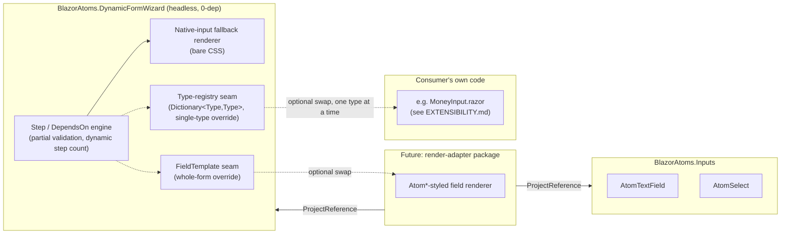
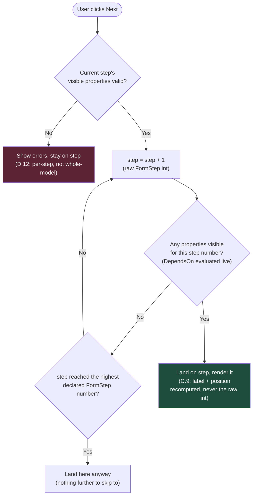
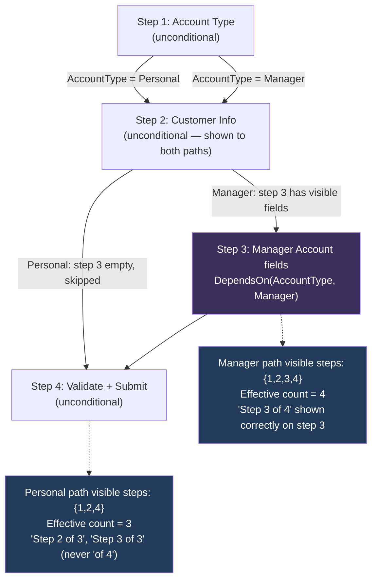
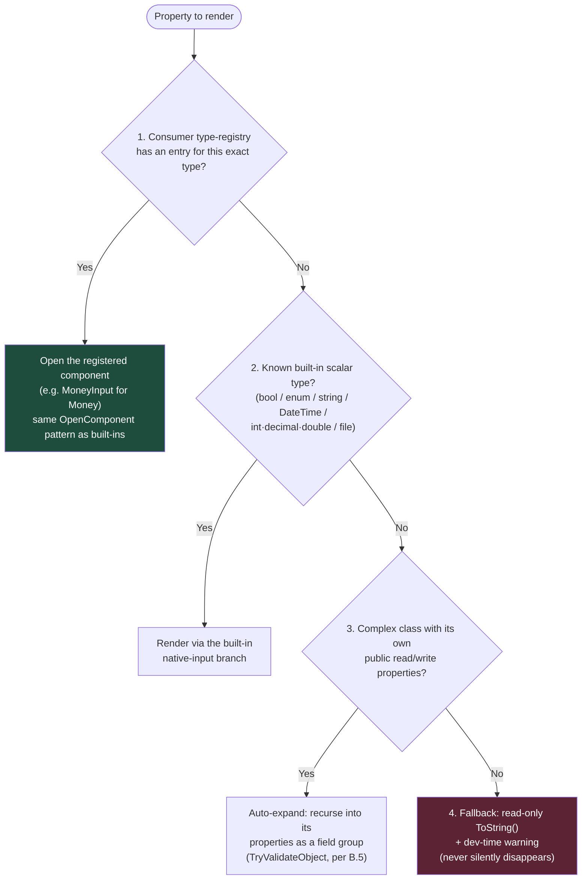

# BlazorAtoms.DynamicFormWizard — Flow Diagrams

Visual companion to `DESIGN-DISCUSSION.md`. Each diagram is captioned with the decision(s) it
documents — read the linked section there for the full rationale.

## 1. Package / architecture split

Documents `DESIGN-DISCUSSION.md` A.1–A.4: the headless core stays a 0-dep leaf; a future adapter
package is the only thing that ever depends on `BlazorAtoms.Inputs`. `FieldTemplate` and the
type-registry are both shown as seams on the core, not hard edges.

## 2. Engine navigation algorithm

Documents `DESIGN-DISCUSSION.md` C.8–C.9: `GoNext` (and `GoPrevious`, mirrored) walk the raw step
counter and skip any step number with zero currently-visible properties — this is the *entire*
mechanism behind both branching and rejoining. No graph structure exists anywhere in the engine.

## 3. Concrete branch/rejoin example — account-type wizard

Documents `DESIGN-DISCUSSION.md` scenario 2 and decision C.9 (dynamic step count differs per
branch — 3 for Personal, 4 for Manager — despite both sharing the same declared `[FormStep]`
numbers 1–4).

## 4. Field-render dispatch priority

Documents `DESIGN-DISCUSSION.md` A.4 — the four tiers, checked in order for every property.

